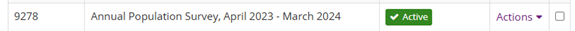
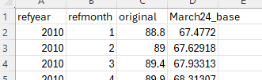
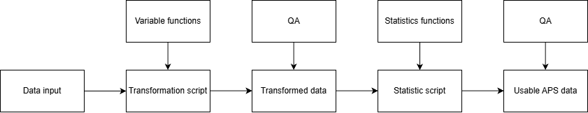
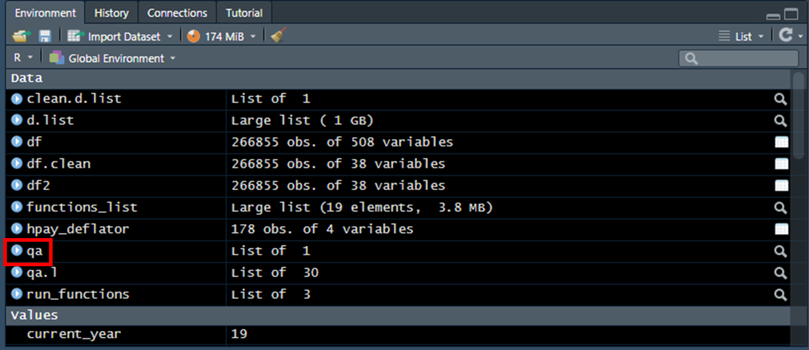

The Annual Population Survey (APS) is a large-scale household survey conducted by the ONS. It provides comprehensive data on the United Kingdom's labour market, as well as detailed information on demographic characteristics, socio-economic conditions, and educational attainment.

As the APS covers Great Britain and collects information on protected characteristics alongside a wide range of socio-economic indicators, it represents a vital data source for the Commission. Its value is particularly significant within the context of Monitor, since we use the APS to extract 8 indicators for GB and all three nations from the Work and Education domains:

-   Work
    -   WRK.EMP.1 Employment rate
    -   WRK.EMP.2 Unemployment rate
    -   WRK.EMP.3 Percentage employed in jobs classed as insecure
    -   WRK.ERN.1 Median hourly employee earnings, including overtime
    -   WRK.OCS.1 Percentage employed in high-paid occupations
-   Education
    -   EDU.EBN.2 Percentage not in employment, education or training (NEET)
    -   EDU.HLL.1 Percentage with degree-level qualifications (adults aged over 25)
    -   EDU.HLL.2 Percentage participating in learning activities in last 3 months

**Requirements:** to extract data from the APS the user will need: RStudio installed, R projects found in the APS project in GitHub, and input data.

<br>

# Data

## APS data

Data for the APS comes from the UK Data Service. The ONS publishes data quarterly and yearly for the APS. Therefore, **the correct APS file to download from the UKDS is one that runs from April to March**. For example, the APS file for the years 2023-2024 would look as follows on the UKDS webpage:



APS data files come in a ".dta" format, which is a format owned by the Stata software. **After downloading the file, make sure that the data file is titled as:** ***"apsp_a21m22_eul_pwta22.dta"***, where the years are represented in 7th, 8th, 10th and 11th character (example here shows year 21-22).

## Deflator series data

For the APS code to run properly, we need an extra data file containing monthly price index (deflator data). The point of this file is to create comparable results for median earnings that consider inflation.

**The deflator file needs to be built and updated manually**. It consists of four columns:

-   refyear: reference year, in numeric values.
-   refmonth: reference month, also in numeric values from 1 to 12
-   original: CPIH index
-   Marchxx_base: rebased series, it is estimated by dividing the values in original by the value of original from March of the latest year times 100 (original/original_march_latest_year \* 100). After estimating this column, **please change the name of the column so that the "xx" in the column name represents the reference year**. For example, in the image below the column name is March24_base, meaning that the CPIH index is being compared with March 2024.



Data for the CPIH index can be found here: [CPIH INDEX](https://www.ons.gov.uk/economy/inflationandpriceindices/timeseries/l522/mm23). After updating the deflator data file, please named it as ***"hpay_deflator.csv"***.

**For the R code to work, the input data (APS raw data, APS transformed data, deflator data, QA files) should be placed inside the correspondent input folder depending on the selected project (transformation, statistics and QA).**

<br>

# The R code

The R code used for APS is adapted from previously used Stata code. It has been validated against data previously published by the Commission. This validation showed that a comparison of outputs from R and Stata produce nearly identical results.

Following RAP standards, R code is highly modular, it uses main scripts that feed from functions located in different script files. It also uses reproducible environments, meaning that your code is expected to run the same way independently of what computer is being used.

Instructions, explanations and definitions can be found within the script as well. The R codes for APS are divided into three projects: transforming data, generating statistics and QA. Each project can be located within its respective folder in GitHub. To run any project, you will need to download the corresponding folder and afterwards follow the instructions below.

Structurally, the overall process to extract APS data can be summarised in the following chart:



As mentioned above,

### APS data transformation

This project folder contains scripts that will clean, transform and extract data from the raw APS file. The project folder should contain the following elements:

-   functions: folder that contains the scripts for functions used in the main script "APS_data_transformation_main.R". Each function has the task to extract variables of interest from the data (PCs, indicators, weights, etc.). The function files names reflect the type of variable they are tasked to extract. Make sure to leave this folder intact.
-   input: folder where to place the APS and deflator data with correct file naming.
-   output: folder where the file with the extracted APS data will be saved after running the script.
-   renv: folder used by the renv() function for reproducibility, please ignore and leave untouched.
-   APS data transformation.Rproj: project file. Will be used to recreate the environment needed for the script to work.
-   APS_data_transformation_main.R: main script. This file is where the main code is writen.
-   renv.lock: file used by the renv() function for reproducibility, please ignore and leave untouched.

#### How to run the transformation code?

The steps to successfully run the transformation code are as follow (using Rstudio):

1.  Place the APS files and deflator data in the input folder within the project folder. Remember that the APS data should be named *"apsp_a21m22_eul_pwta22.dta"* where the years are represented in the 7th, 8th, 10th and 11th character (example here shows year 21-22). The deflator data should be named *"hpay_deflator.csv"*.
2.  Open APS data transformation.Rproj file with Rstudio.
3.  In the Rstudio console, copy the following code and press enter:

```{r}
#| eval: false
if (!requireNamespace("renv", quietly = TRUE)) { install.packages("renv")}
renv::restore()
```

4.  In the console, copy the following code and press enter:

```{r}
#| eval: false
source("APS_data_transformation_main.R")
```

This will create a series of messages to be printed in the console. These messages give information about the progress that R has done by cleaning and extracting variables from the APS. There will be a final message notifying you that R has finished running the code.

After finishing running the code, you can explore how variables were recorded through the process by clicking the "qa" element on the Rstudio environment panel:



The console will also notify you if there is any error. The code is constructed to stop and warn you if it finds any error or inconsistency. **If any issues arise while running the code, please notify any team statisticians.**

Once you run all the code, check the output folder within the project folder. If everything ran smoothly, a csv file named *"aps_transformed_data.csv"* will be saved in the output folder. This file contains the extracted data from the APS, and will be the main data to feed the statistic script.

#### How to QA the transformed data?

To QA that the process ran correctly, within the csv file *"aps_transformed_data.csv"* perform the following steps:

-   Check that the expected variables exist (PCs, indicator variables, geographical variables, weights)
-   Using the filter option in excel, check whether there are odd values within variables. For example, finding a categorical value within a numerical variable or vice versa.
-   In categorical variables, check that the categories match the variable (e.g., ethnicity variable has only ethnicity levels).

A more detailed QA process take place after running the statistics part of the APS.

### APS data statistics

This project folder contains scripts that will produce statistics (percentages/estimates, standard errors, confidence intervals, difference in estimates, standard error of difference in estimates, p-values) from the transformed APS file *"aps_transformed_data.csv"*. The project folder should contain the following elements:

-   functions: folder that contains the scripts for functions used in the main script "APS_stats_main.R".
-   input: folder containing the data from APS data transformation. Within this folder the user needs to place the file *"aps_transformed_data.csv"*
-   output: folder where the file with the APS statistics will be saved after running the script.
-   renv: folder used by the renv() function for reproducibility, please ignore and leave untouched.
-   APS statistics.Rproj: project file. Will be used to recreate the environment needed for the script to work.
-   APS_stats_main.R: main script to be run. This will be the file that needs to be open and run to extract APS data.
-   renv.lock: file used by the renv() function for reproducibility, please ignore and leave untouched.

#### How to run the statistics code?

The process is similar to running the transformation code. The steps to run the statistics code are:

1.  Place the file *"aps_transformed_data.csv"* created during the transformation process in the input folder within the project folder.
2.  Open APS data transformation.Rproj file with Rstudio.
3.  In the Rstudio console, copy the following code and press enter:

```{r}
#| eval: false
if (!requireNamespace("renv", quietly = TRUE)) { install.packages("renv")}
renv::restore()
```

4.  In the console, copy the following code and press enter:

```{r}
#| eval: false
source("APS_stats_main.R")
```

This will create a series of messages to be printed in the console. These messages give information about the combinations of from which R is producing statistics. There will be a final message notifying you that R has finished running the code.

The console will also notify you if there is any error. The code is constructed to stop and warn you if it finds any error or inconsistency. *If any issues arise while running the code, please notify any team statisticians*.

Once all the code has run, check the output folder within the project directory. If the script has executed successfully, a CSV file named *"aps_stats.csv"* will be saved there. This file contains statistics from the APS and is the output used in reports such as the Monitor.

Note that running this script can take between 30 minutes and over an hour depending on the number of APS files to analyse. Also note that while the code runs, some alert messages might appear warning the user that the sample size is too small (e.g., "*ALERT: the sample size is less than 10 for PCsec and median earnings for 2022*"). This warning was placed on purpose so the user can be aware where sample size gets very small.

#### How to QA the statistics data?

The statistical output requires more detailed QA than the transformed data for three reasons. First, while the transformation process primarily involves reordering and relabeling data, the statistical process involves modelling and inference, which introduces greater complexity and therefore requires a more quantitative QA approach. By contrast, transformed data can often be quality assured through visual inspection to confirm that variables have been processed as expected.

Second, the transformed dataset is wider and contains more variables, making comprehensive QA more difficult than for the statistical output.

Third, any issues identified during the QA of the statistical output can typically be traced back and located within either the transformation stage or the statistical processing stage, making the statistical QA an effective point for identifying problems across the pipeline.

Finally, the QA the statistics data give us information about important or meaningful data variations in time.

To start the statistics data QA process, first apply the following steps to the file *"aps_stats.csv"*:\

-   Check that the expected variables exist (PCs, indicator variables, estimates, geographical variables)
-   Using the filter option in excel, check whether there are odd values within variables. For example, finding a categorical value within a numerical variable or vice versa.
-   In categorical variables, check that the categories match the variable (e.g., ethnicity variable has only ethnicity levels). - Identify extreme values, either too large or too small in the columns "per". Determine whether these values make sense in their context.
-   In the same "per" column, make sure that values are always within the range of 0 and 100.
-   In the p-value column make sure that numerical values are between 0 and 1.
-   In the unweighted base column make sure that all numerical values are integers.

A second QA analysis on the statistics data involves comparing estimates from newly produced data with previous data that has been already gone through a QA process.

### APS QA

This project folder contains a script that will help QA the estimates and statistics produced. The project folder should contain the following elements:

-   input: folder containing the data from APS data transformation. Within this folder the user needs to place the reference file as a csv named *"ref.csv"* and the file to QA named *"comp.csv"*. If you don't have a reference file, please contact one of our statisticians to obtain one
-   output: folder where QA file will be saved.
-   renv: folder used by the renv() function for reproducibility, please ignore and leave untouched.
-   APS QA.Rproj: project file. Will be used to recreate the environment needed for the script to work.
-   APS_QA_main.R: main script to be run. This will be the file that needs to be open and run to QA new data from the APS.
-   renv.lock: file used by the renv() function for reproducibility, please ignore and leave untouched.

To create the file *"comp.csv"*, simply copy paste the statistics output file *"aps_stats.csv"* in the input folder and rename it to *"comp.csv"*.

#### How to run the QA code?

1.  Place the *"ref.csv"* and *"comp.csv"* files in the input folder
2.  Open the APS QA.Rproj file with Rstudio.
3.  In the console copy the following code and press enter:

```{r}
#| eval: false
if (!requireNamespace("renv", quietly = TRUE)) { install.packages("renv")}
renv::restore()
```

4.  In the console, copy the following code and press enter:

```{r}
#| eval: false
source("APS_QA_main.R")
```

<br>

# Potential issues with the APS

There are a series of potential issues with the APS regarding the R code stopping because it has found an error, or the output files presenting issues and mistakes. This is mainly because the APS suffers updates and modifications that can affect the R code functionality, at least until the code is also updated to match any changes in the APS. Examples of these issues can be:

-   Rename or removal of a variable used in the code. Sometimes, in new editions of APS certain variables are dropped or renamed. If this occurs, the R code will show an error during the transformation process and will stop running data.
-   Change in categories within a variable. Categories within variables can change, for example, categories in variables like Ethnicity or socioeconomic status are often updated to reflect a more actual picture of society. **This issue does not always trigger an error in R**. Therefore, it is important to consult the documentation and check for changes before running the code.
-   Variables are updated, but old variables are left in the APS. Certain variables can be updated, but instead of renaming the variable, the updated variable is listed under a new name. For example, the variable that contains the weights in the APS is called PWTA22 after 2019, and PWTA18 between 2011 and 2019. It can occur that in a single APS data file you PWTA18 and PWTA22. If the R code is not updated to reflect this change, the population estimates will be calculated using the wrong weights. This is why is important to consult the documentation and research if any changes has been done to variables within the APS. Again, **this issue does not always trigger an error in R**

<br>

# Variables used for APS analysis

Below is a list containing variables names and descriptions that are used during the APS transformation process. This list can serve as a guide for QA, methodological changes or for updating the code:

| Variable(s)                | Description                                                          |
|----------------------------|----------------------------------------------------------------------|
| AGE                        | Age of respondent                                                    |
| ATTEND                     | Whether still attending course                                       |
| COUNTRY                    | Country within UK                                                    |
| DISEA                      | Current disability                                                   |
| ED13WK                     | Job related training or education in the last 3 months               |
| ED4WK                      | Job related training or education in the last 4 weeks (in work)      |
| ENROLL                     | Enrolled on full-time/part-time education course (excluding leisure) |
| ETHGBEUL                   | Ethnicity (11 categories), GB level                                  |
| FUTUR13                    | Job related training or education in the last 3 months               |
| FUTUR4                     | Job related training or education in the last 4 weeks (unemployed)   |
| GOVTOF                     | Government office regions -- summary                                 |
| HOURPAY                    | Gross hourly pay                                                     |
| INECAC05                   | Basic economic activity (ILO definition) (reported)                  |
| MARSTA                     | Marital status                                                       |
| NSECMJ10, NSECMJ20         | NS-SEC major group                                                   |
| PWTA18, PWTA22             | Person weight                                                        |
| QUAL_1, QUAL21_1           | Whether degree-level qualification obtained                          |
| REFWKM                     | Reference week month                                                 |
| REFWKY                     | Reference week year                                                  |
| RELIG11                    | Religion, GB level                                                   |
| SC10MMJ, SC20MMJ           | Major occupation group (main job)                                    |
| SELF1, SELF2, SELF3, SELF4 | Self-employed status                                                 |
| SEX                        | Sex of respondent                                                    |
